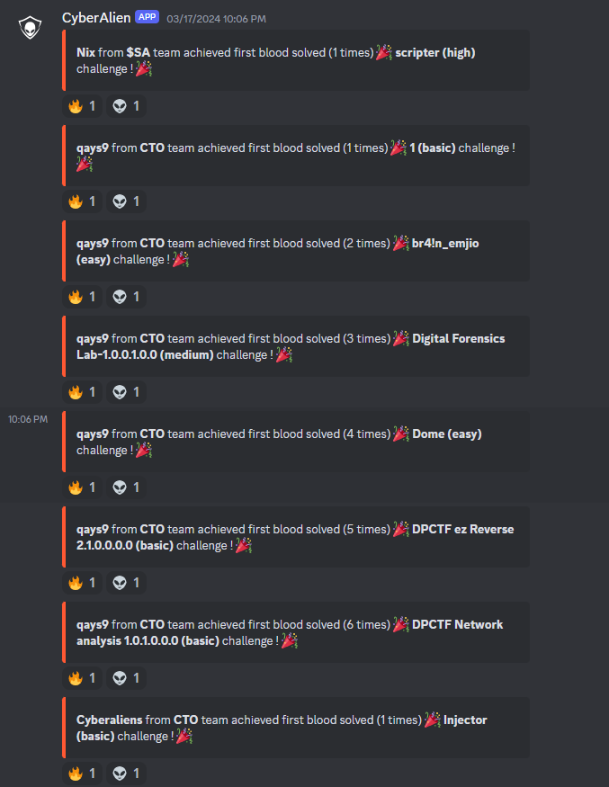
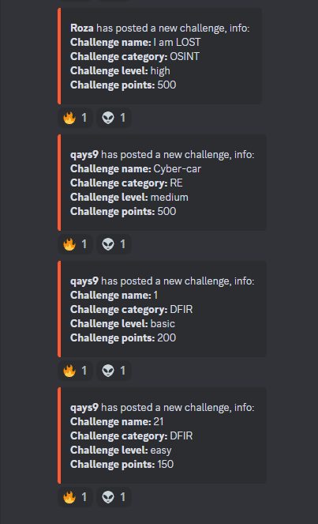

```md
# Discord Bot for First Blood Challenges and New Challenges Notifications

This Discord bot is designed to manage and notify users about "First Blood" challenges and new challenges in a competition. The bot uses MySQL for data storage and retrieval, and the Discord API for notifications.


## Features

- **First Blood Notifications**: Notifies a specific channel when a user achieves the first blood on a challenge.
- **New Challenge Notifications**: Notifies admin and general channels when new challenges are posted.
- **Database Integration**: Retrieves data from a MySQL database to check for first blood and new challenges.
- **Persistent Storage**: Uses JSON files to maintain state across bot restarts.

## Requirements

- Python 3.8+
- Discord.py
- Aiohttp
- PyMySQL

## Setup

1. **Clone the repository**:

    ```bash
    git clone https://github.com/qays3/Notification-CTF-Discord-Bot.git
    cd Notification-CTF-Discord-Bot
    ```

2. **Install dependencies**:

    ```bash
    pip install -r requirements.txt
    ```

3. **Configure Database Connection**:

    Edit the following variables in the script to match your MySQL database configuration:

    ```python
    hostname = 'localhost'
    username = 'root'
    password = ''
    database = ''
    ```

4. **Configure Discord Bot Token**:

    Replace the placeholder with your actual bot token in the `start_bot` function:

    ```python
    await client.start('YOUR_BOT_TOKEN') # Token here
    ```

5. **Run the bot**:

    ```bash
    python main.py
    ```

## Database Schema

The bot uses the following MySQL database tables:
```bash
CREATE TABLE `challenges` (
  `id` int(255) NOT NULL,
  `CHname` varchar(255) NOT NULL,
  `CHpoint` int(255) NOT NULL,
  `CHhint` varchar(255) NOT NULL,
  `CHlink` varchar(255) DEFAULT NULL,
  `CHfile` varchar(255) DEFAULT NULL,
  `CHcategory` varchar(255) NOT NULL,
  `CHstatus` varchar(255) NOT NULL DEFAULT 'OFF',
  `adminName` varchar(255) NOT NULL,
  `CHlevel` varchar(255) DEFAULT NULL,
  `CHtimestamp` timestamp NOT NULL DEFAULT current_timestamp() ON UPDATE current_timestamp(),
  PRIMARY KEY (`id`)
) ENGINE=InnoDB DEFAULT CHARSET=utf8mb4 COLLATE=utf8mb4_unicode_ci;
ALTER TABLE challenges MODIFY adminName VARCHAR(255) COLLATE utf8mb4_general_ci;

CREATE TABLE `COMPEINFO` (
  `compe_id` int(11) NOT NULL,
  `time_start` timestamp NOT NULL DEFAULT current_timestamp() ON UPDATE current_timestamp(),
  `time_end` timestamp NOT NULL DEFAULT '0000-00-00 00:00:00',
  PRIMARY KEY (`compe_id`)
) ENGINE=InnoDB DEFAULT CHARSET=utf8mb4 COLLATE=utf8mb4_unicode_ci;

CREATE TABLE `solvedchallenges` (
  `id` int(11) NOT NULL,
  `userId` int(11) NOT NULL,
  `CHid` int(255) NOT NULL,
  `team_id` int(11) DEFAULT NULL,
  `Time` timestamp NOT NULL DEFAULT current_timestamp() ON UPDATE current_timestamp(),
  PRIMARY KEY (`id`),
  KEY `userId` (`userId`),
  KEY `CHid` (`CHid`),
  KEY `solvedchallenges_team_fk` (`team_id`),
  CONSTRAINT `fk_solvedchallenges_challenges` FOREIGN KEY (`CHid`) REFERENCES `challenges` (`id`) ON DELETE CASCADE,
  CONSTRAINT `fk_solvedchallenges_team` FOREIGN KEY (`team_id`) REFERENCES `Team` (`Teamid`) ON DELETE SET NULL,
  CONSTRAINT `fk_solvedchallenges_users` FOREIGN KEY (`userId`) REFERENCES `users` (`id`) ON DELETE CASCADE
) ENGINE=InnoDB DEFAULT CHARSET=utf8mb4 COLLATE=utf8mb4_unicode_ci;

CREATE TABLE `Team` (
  `Teamid` int(11) NOT NULL,
  `leader_id` int(11) DEFAULT NULL,
  `TeamName` varchar(255) NOT NULL,
  PRIMARY KEY (`Teamid`),
  KEY `Team_ibfk_1` (`leader_id`),
  CONSTRAINT `Team_ibfk_1` FOREIGN KEY (`leader_id`) REFERENCES `users` (`id`) ON DELETE CASCADE
) ENGINE=InnoDB DEFAULT CHARSET=utf8mb4 COLLATE=utf8mb4_unicode_ci;

CREATE TABLE `users` (
  `id` int(11) NOT NULL,
  `UserName` varchar(255) NOT NULL,
  `team_id` int(11) DEFAULT NULL,
  PRIMARY KEY (`id`),
  KEY `team_id` (`team_id`),
  CONSTRAINT `users_ibfk_1` FOREIGN KEY (`team_id`) REFERENCES `Team` (`Teamid`) ON DELETE CASCADE
) ENGINE=InnoDB DEFAULT CHARSET=utf8mb4 COLLATE=utf8mb4_unicode_ci;
```
- `challenges`: Stores challenge information.
- `COMPEINFO`: Stores competition start and end times.
- `solvedchallenges`: Stores records of solved challenges.
- `Team`: Stores team information.
- `users`: Stores user information.

## Bot Functionality

### Database Connection

The bot connects to a MySQL database to retrieve information about challenges and competition status.

```python
def create_connection():
    try:
        connection = pymysql.connect(
            host=hostname,
            user=username,
            password=password,
            database=database,
            charset='utf8mb4',
            cursorclass=pymysql.cursors.DictCursor
        )
        return connection
    except pymysql.MySQLError as e:
        print(f"Error: {e}")
        return None
```

### First Blood Notifications

The bot checks for first blood achievements every second and sends a notification to a specific channel.



```python
@tasks.loop(seconds=1)
async def check_first_blood():
    global first_blood_data

    channel_id = 933
    channel = client.get_channel(channel_id)
    first_blood_entries = await get_first_blood()

    if first_blood_entries:
        for entry in first_blood_entries:
            challenge_id = entry['id']
            # Additional logic for sending notifications
```

### New Challenge Notifications

The bot checks for new challenges every minute and sends notifications to both admin and general channels.



```python
@tasks.loop(seconds=60)
async def check_new_chall():
    global new_chall_data

    general_channel_id = 93
    admin_channel_id = 93101

    new_chall_entries = await get_new_chall()
    competition_started = await is_competition_started()

    general_channel = client.get_channel(general_channel_id)
    admin_channel = client.get_channel(admin_channel_id)
    # Additional logic for sending notifications
```

### On Ready Event

Starts the loop tasks when the bot is ready.

```python
@client.event
async def on_ready():
    print("Bot is ready.")
    check_first_blood.start()
    check_new_chall.start()
```

### Start Bot

Handles starting and restarting the bot.

```python
async def start_bot():
    while True:
        try:
            await client.start('YOUR_BOT_TOKEN') # Token here
        except aiohttp.ClientConnectorError as e:
            print(f"Connection failed: {e}")
            print("Retrying in 5 seconds...")
            await asyncio.sleep(5)
        except KeyboardInterrupt:
            print("Bot stopped by the user.")
            break
        except Exception as e:
            print(f"An error occurred: {e}")
            print("Retrying in 5 seconds...")
            await asyncio.sleep(5)

loop = asyncio.get_event_loop()
loop.run_until_complete(start_bot())
```

## License

This project is licensed under the MIT License.

## Contributing

Contributions are welcome! Please open an issue or submit a pull request for any improvements or bug fixes.
```
